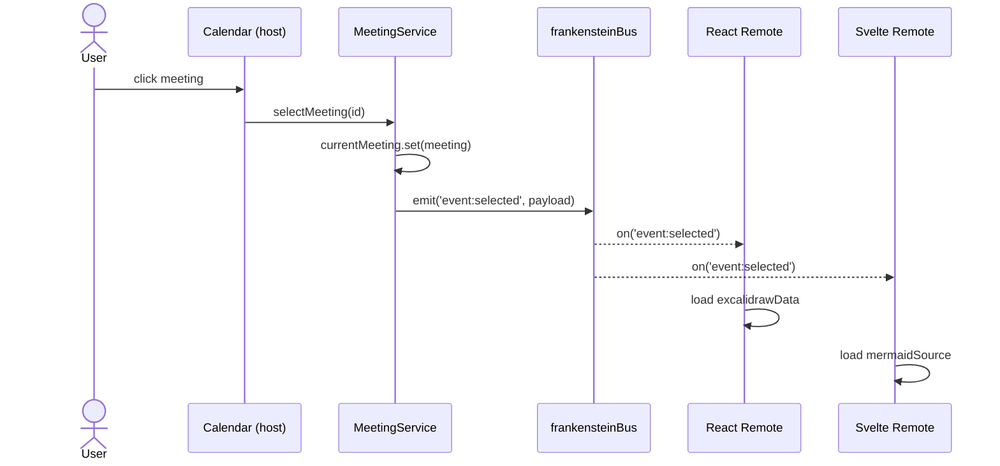

# Frankenstein Meeting Room

![[Frankenstein Meeting Room Mockup.png]]

A deliberately small demo of a real enterprise frontend integration pattern: one host application, multiple inherited capabilities from foreign frameworks, one shared business context.

> Angular owns the meeting context. React owns the whiteboard capability. Svelte owns the diagramming capability. The host coordinates all three into one workspace.

---

## Goal & Non-Goal

**Goal.** Demonstrate that a single Angular host can integrate capabilities from React and Svelte ecosystems via Native Federation — with shared business context, host-owned persistence, and clean integration boundaries.

**Non-Goal.** This is not a meeting app. It is not production software. Anyone asking "but doesn't a real meeting tool need X?" gets the answer: _Production concern. Prototype demonstrates the integration architecture._

**Time budget.** 2-5 working days. Not weeks.

---

## Architectural Principle

> **Remote owns capability. Host owns business context and persistence.**

This is the most important sentence in the demo. It frames every design decision and is the line to put on a slide at the start of every video, post, and README.

---

## Isolation: Remote = Island = Custom Element

Host and remotes run on different frameworks, so there is no shared component, hook, or reactivity model. Each remote is a complete, self-contained application in its own framework — an island.

A remote exposes a Custom Element that wraps the entire application and boots independently on mount. The host consumes remotes exclusively through these Custom Elements, like any other DOM element.

**One communication channel: the event bus.** No initial state via attributes or properties. Remotes are dumb on mount — they know nothing until the bus tells them. The host delivers business context exclusively over the bus, never via component config.

**Boot pattern.** On mount, every remote dispatches `context:request` on the bus. The host replies with the current `event:selected`. This protects late-subscribing remotes that mount after the initial broadcast.

---

## Architecture

```
Angular Host (Frankenstein Meeting Room)
├── Shell + Routing + Layout
├── Calendar (Schedule-X, native, NOT federated)
├── Event Detail View
│   ├── Excalidraw Slot   ← React Remote   (Native Federation)
│   └── Mermaid Editor Slot ← Svelte Remote (Native Federation)
├── Event Bus (Host ↔ Remotes)
└── LocalStorage Repository (per meeting)
```

The remotes never communicate with each other directly. Always via the host. This enforces the architectural principle.

---

## Technology Choices

|Layer|Choice|Rationale|
|---|---|---|
|Host framework|Angular 20+|Positioning, Native Federation Advisory expertise|
|Calendar|Schedule-X (`@schedule-x/angular`)|Modern UI, screenshot-friendly, good Angular adapter|
|Whiteboard|`@excalidraw/excalidraw` (React 18+)|Officially embeddable form of a real, iconic OSS app|
|Diagram editor|`mermaid` library + small Svelte 5 wrapper|Lightweight, federation-friendly. **Not** forking Mermaid Live Editor — deliberate scope decision|
|Federation runtime|Native Federation v4 + Orchestrator (`@softarc/native-federation-orchestrator`)|Semver-aware version resolution, persistent caching, framework-agnostic|
|Host build|`@angular-architects/native-federation-v4` (Angular adapter, replaces default Angular builder)|Official Angular adapter, generates host's own `remoteEntry.json`, two-phase bootstrap|
|Remote build|`@softarc/native-federation-esbuild` (driven from a `build.mjs` script)|Native Federation's framework-agnostic remote builder. Vite is **not** officially supported|
|Persistence|LocalStorage|No backend in scope|

---

## Data Model

```typescript
import type { ExcalidrawElement } from '@excalidraw/excalidraw/element/types';

type ExcalidrawDemoData = {
  elements: ExcalidrawElement[];
  appState?: Partial<{
    viewBackgroundColor: string;
    gridSize: number;
    gridStep: number;
    gridModeEnabled: boolean;
  }>;
};

type Meeting = {
  id: string;
  title: string;
  start: string;                        // ISO timestamp
  end: string;                          // ISO timestamp
  attendees: string[];
  excalidrawData?: ExcalidrawDemoData;
  mermaidSource?: string;
  updatedAt: string;                    // any change to the meeting
  excalidrawUpdatedAt?: string;         // last whiteboard change — Integration Moment 5
  mermaidUpdatedAt?: string;            // last diagram change    — Integration Moment 5
};
```

Stored in LocalStorage, keyed by `meeting.id`. Nothing else.

The persisted `appState` is the strict export subset (four keys above; Excalidraw exports `lockedMultiSelections` too but it's edge-case tooling, not demo-relevant). On restore, Excalidraw accepts `Partial<AppState>` via `initialData`, so the asymmetry between stored shape and load shape is benign — no round-trip loss. `files` (image attachments) are explicitly out of scope.

---

## Host State

The host holds its domain state in a single Angular service, using Signals as the primary state form. No NgRx — overkill for the scope. RxJS only where a stream genuinely helps (none required in V1).

The service is also the single broadcast point: every entry path that mutates context (calendar click, deep link, future hotkey) goes through one setter that updates state and dispatches `event:selected` in the same step.

```ts
import { seed } from './seed';

class MeetingService {
  readonly currentMeeting = signal<Meeting | null>(null);
  readonly meetings = signal<Meeting[]>([]);

  constructor() {
    this.meetings.set(this.loadAll());
    on('drawing:changed', (p) => this.applyDrawingChange(p));
    on('diagram:changed', (p) => this.applyDiagramChange(p));
    on('context:request', () => this.rebroadcastCurrent());
  }

  selectMeeting(id: string): void {
    const meeting = this.meetings().find(m => m.id === id) ?? null;
    this.currentMeeting.set(meeting);
    if (meeting) emit('event:selected', { meetingId: meeting.id, initialData: meeting });
  }

  private applyDrawingChange(p: { meetingId: string; excalidrawData: ExcalidrawDemoData }): void {
    if (p.meetingId !== this.currentMeeting()?.id) return;   // stale-update guard
    const now = new Date().toISOString();
    this.updateMeeting(p.meetingId, m => ({
      ...m, excalidrawData: p.excalidrawData, excalidrawUpdatedAt: now, updatedAt: now,
    }));
  }

  // applyDiagramChange — analogous, writes mermaidSource + mermaidUpdatedAt, same stale guard

  private updateMeeting(id: string, mut: (m: Meeting) => Meeting): void {
    const next = this.meetings().map(m => m.id === id ? mut(m) : m);
    this.meetings.set(next);
    if (this.currentMeeting()?.id === id) this.currentMeeting.set(next.find(m => m.id === id)!);
    this.persistAll();
  }

  private rebroadcastCurrent(): void {
    const m = this.currentMeeting();
    if (m) emit('event:selected', { meetingId: m.id, initialData: m });
  }

  private loadAll(): Meeting[] {
    const raw = localStorage.getItem('frankenstein:meetings');
    return raw ? JSON.parse(raw) : seed;
  }

  private persistAll(): void {
    localStorage.setItem('frankenstein:meetings', JSON.stringify(this.meetings()));
  }
}
```

**Persistence.** LocalStorage directly inside the service — no Repository pattern, no abstract interface. With a single entity (`Meeting`) whose domain shape and storage shape are identical, the indirection would be empty boilerplate. If later questioned about IndexedDB or a backend: explicit *Out of Scope* — the demo stays under LocalStorage's ~5 MB ceiling for any realistic Excalidraw payload at three sample meetings.

**Initial seed.** On first start, `loadAll()` finds an empty `localStorage` and falls back to the `seed` constant — three hard-coded sample meetings in `seed.ts`. Satisfies the Day-1 done criterion *"three sample events visible"* without runtime randomness.

**Stale-update defense.** Both `applyDrawingChange` and `applyDiagramChange` start with `if (p.meetingId !== this.currentMeeting()?.id) return;`. Without this guard, a `drawing:changed` in flight from meeting A would silently land in meeting B's persisted state when the user switches mid-stream — exactly the kind of race condition that never shows up in dev but always shows up in the workshop Q&A.

**Debouncing.** Drawing updates are debounced *at the sender* (Excalidraw's `onChange` → ~500ms debounce → `emit('drawing:changed', ...)`), so the bus carries one event per ~500ms instead of one per pixel-move. The service persists synchronously on every event it receives — no second-stage debounce. One throttle, clear ownership at the producer.

---

## Event Bus Contract

Four events. This is the _entire_ cross-framework communication.

|Event|Direction|Payload|
|---|---|---|
|`context:request`|Remote → Host|`{}`|
|`event:selected`|Host → Remotes|`{ meetingId, initialData }`|
|`drawing:changed`|React Remote → Host|`{ meetingId, excalidrawData }`|
|`diagram:changed`|Svelte Remote → Host|`{ meetingId, mermaidSource }`|

---

## Event Bus Implementation

A dedicated `EventTarget` instance exposed as a global singleton, wrapped by a thin typed module (~20 lines) that every host and remote imports as plain TypeScript source — not as a Native Federation shared module. The `globalThis.frankensteinBus` is the only piece of cross-bundle state; the wrapper itself is idempotent.

```ts
// bus.ts — imported source-only by host and all remotes

type BusEvents = {
  'context:request': {};
  'event:selected':  { meetingId: string; initialData: Meeting };
  'drawing:changed': { meetingId: string; excalidrawData: ExcalidrawDemoData };
  'diagram:changed': { meetingId: string; mermaidSource: string };
};

const bus = (globalThis.frankensteinBus ??= new EventTarget()) as EventTarget;

export function emit<K extends keyof BusEvents>(name: K, payload: BusEvents[K]) {
  bus.dispatchEvent(new CustomEvent(name, { detail: payload }));
}

export function on<K extends keyof BusEvents>(
  name: K,
  handler: (payload: BusEvents[K]) => void,
): () => void {
  const listener = (e: Event) => handler((e as CustomEvent).detail);
  bus.addEventListener(name, listener);
  return () => bus.removeEventListener(name, listener);
}
```

Same-origin, single-tab, fire-and-forget. Late subscribers handled by `context:request`; debouncing happens at the sender (e.g., Excalidraw `onChange` debounced to ~500ms before dispatch), not in the bus. The `on()` return value is the unsubscribe function — used by remotes inside `disconnectedCallback`.

---

## Communication Flow

Canonical end-to-end flow: user clicks a meeting in the calendar, both remotes update. The calendar is host-internal, so its click does not traverse the bus — it goes directly into the service. The bus is only crossed once, host → remotes.



Reverse direction (e.g., `drawing:changed`) follows the same shape with the arrow flipped: Remote emits, Service consumes, Service persists. Boot of a late-mounting remote: Remote emits `context:request`, Service replies with `event:selected` via `rebroadcastCurrent()`.

---

## Remote Anatomy

The host is the top-level Angular app and exposes nothing — Custom Element wrapping applies to remotes only, never to the host. Schedule-X is consumed as a native Angular component, no Angular Elements involved.

Each remote is a standalone esbuild-built bundle (via the Native Federation esbuild adapter, driven from a `build.mjs` script — see *Native Federation Setup* below) whose entry point registers a Custom Element. The Custom Element wraps the entire framework app and uses Web Components lifecycle hooks (`connectedCallback` / `disconnectedCallback`) to bootstrap and tear down the internal framework. Light DOM only — Excalidraw and similar tools struggle with Shadow DOM (style cascade issues).

**Standalone development:** each remote ships an `index.html` that hosts the Custom Element directly. `npm run dev` runs the remote alone on its own port, fully usable for development and debugging without the host. **In federated mode** the same bundle is consumed by the host: the `index.html` is unused, the host renders the Custom Element dynamically inside its detail view, Native Federation resolves the bundle, `customElements.define` runs, `connectedCallback` fires — identical from there.

```html
<!-- remote-react/index.html (standalone only) -->
<body>
  <whiteboard-remote></whiteboard-remote>
  <script type="module" src="/src/main.ts"></script>
</body>
```

```ts
// remote-react/src/main.ts
import { createRoot, Root } from 'react-dom/client';
import { App } from './App';
import { on, emit } from './bus';

class WhiteboardRemote extends HTMLElement {
  private root?: Root;
  private unsubs: Array<() => void> = [];
  private meetingId: string | null = null;
  private initialData: ExcalidrawDemoData | null = null;

  connectedCallback() {
    this.root = createRoot(this);
    this.unsubs.push(on('event:selected', ({ meetingId, initialData }) => {
      this.meetingId = meetingId;
      this.initialData = (initialData as Meeting).excalidrawData ?? null;
      this.render();
    }));
    emit('context:request', {});
  }

  disconnectedCallback() {
    this.unsubs.forEach(u => u());
    this.root?.unmount();
  }

  private render() {
    this.root?.render(
      <App
        initialData={this.initialData}
        onChange={(data) =>
          emit('drawing:changed', { meetingId: this.meetingId!, excalidrawData: data })}
      />
    );
  }
}

customElements.define('whiteboard-remote', WhiteboardRemote);
```

**State management.** Built-in only: `useState` / `useReducer` for React, Runes (`$state`, `$derived`) for Svelte. No Jotai, Zustand, Redux, or similar — the remote's tree is too small to justify them, and cross-remote state is the bus's job.

**Standalone mock host.** When run via `npm run dev`, there is no host to answer `context:request`. A small dev-only module fakes the host: replies with a sample `Meeting` and logs outgoing events to the console. Loaded conditionally so it never lands in the federation bundle.

```ts
// remote-react/src/standalone-host.ts — dev only
import { on, emit } from './bus';

const fakeMeeting: Meeting = {
  id: 'demo-001',
  title: 'Standalone Demo',
  start: new Date().toISOString(),
  end: new Date(Date.now() + 3600_000).toISOString(),
  attendees: [],
  updatedAt: new Date().toISOString(),
};

on('context:request', () => {
  emit('event:selected', { meetingId: fakeMeeting.id, initialData: fakeMeeting });
});
on('drawing:changed', (p) => console.log('[mock host]', p));
on('diagram:changed', (p) => console.log('[mock host]', p));
```

Plugged into `main.ts` via a build-time replacement, just before the `customElements.define` call. `process.env.NODE_ENV` is substituted at build time via esbuild's `define` option (set in `build.mjs`):

```ts
if (process.env.NODE_ENV === 'development') await import('./standalone-host');
customElements.define('whiteboard-remote', WhiteboardRemote);
```

The Svelte remote follows the same shape — esbuild build, Custom Element wrapper, standalone `index.html`, dev-only mock host — with `new MermaidEditor({ target: this, props: {...} })` instead of `createRoot`. For Svelte the `build.mjs` includes the `esbuild-svelte` plugin via `adapterConfig.plugins`.

---

## Native Federation Setup

Native Federation **v4** with the **Orchestrator** runtime (`@softarc/native-federation-orchestrator`) — not the classic runtime. The Orchestrator brings semver-aware version resolution, persistent caching of `remoteEntry.json` data, and share scopes. Classic Runtime is only better when the host does SSR; not our case.

### Host (Angular `dynamic-host`)

The host is scaffolded via the v4 Angular adapter:

```bash
npm i -D @angular-architects/native-federation-v4
ng g @angular-architects/native-federation-v4:init --project shell --port 4200 --type dynamic-host
```

This swaps the Angular builder in `angular.json` from `@angular/build:application` to `@angular-architects/native-federation-v4:build` (the original is renamed to `esbuild` / `serve-original`), splits the entry into `main.ts` (init-federation) and `bootstrap.ts` (the real Angular bootstrap), and generates `federation.manifest.json` plus `federation.config.mjs`.

The host has its own `remoteEntry.json` — *not* because it's loadable as a remote, but as a **shared-deps manifest** for the orchestrator's version resolver. With `hostRemoteEntry`, the host wins every version conflict for libraries it brings (Angular, RxJS, etc.). In our specific demo, host and remotes barely share anything (three disjoint frameworks), so the `shared` section is nearly empty — but the schematic generates it by default and there's no reason to remove it.

Two-phase bootstrap (generated by the schematic):

```ts
// shell/src/main.ts
import { initFederation } from '@softarc/native-federation-orchestrator';
import {
  useShimImportMap, consoleLogger, globalThisStorageEntry,
} from '@softarc/native-federation-orchestrator/options';

initFederation('/assets/federation.manifest.json', {
  ...useShimImportMap({ shimMode: true }),
  logger: consoleLogger,
  storage: globalThisStorageEntry,
  hostRemoteEntry: './remoteEntry.json',
})
  .then(({ loadRemoteModule }) =>
    import('./bootstrap').then(m => m.bootstrap(loadRemoteModule)))
  .catch(err => console.error(err));
```

```ts
// shell/src/bootstrap.ts
import { bootstrapApplication } from '@angular/platform-browser';
import { AppComponent } from './app/app.component';
import type { LoadRemoteModule } from '@softarc/native-federation-orchestrator';

export const bootstrap = (loader: LoadRemoteModule) =>
  bootstrapApplication(AppComponent, { providers: [/* ... */] });
```

Phase 1 (`initFederation`): manifest fetch, version resolution, import-map injection. Phase 2 (`./bootstrap`): the actual `bootstrapApplication(AppComponent, ...)` runs — every Angular import in this phase resolves through the freshly-written import map.

### Manifest

```json
// shell/public/federation.manifest.json
{
  "whiteboard": "http://localhost:3000/remoteEntry.json",
  "mermaid":    "http://localhost:4000/remoteEntry.json"
}
```

One file per environment (`.dev.json`, `.prod.json`), swapped via `fileReplacements` in `angular.json` or env-specific deploy. Same machinery for dev and prod — only the URLs change.

### Remotes (esbuild adapter)

Each remote is built with `@softarc/native-federation-esbuild`, driven by a hand-written `build.mjs`. **No Vite** — the official adapter is esbuild-based and framework-agnostic.

```js
// remote-react/federation.config.mjs
import { withNativeFederation, shareAll } from '@softarc/native-federation/config';

export default withNativeFederation({
  name: 'whiteboard',
  exposes: { './Bootstrap': './src/main.tsx' },
  shared: {
    ...shareAll({ singleton: true, strictVersion: true, requiredVersion: 'auto' }, {
      overrides: {
        react:       { singleton: true, strictVersion: true, requiredVersion: 'auto', includeSecondaries: { keepAll: true } },
        'react-dom': { singleton: true, strictVersion: true, requiredVersion: 'auto', includeSecondaries: { keepAll: true } },
      },
    }),
  },
  features: { ignoreUnusedDeps: true },
  skip: ['react-dom/server', 'react-dom/server.node', 'react-dom/server.browser', 'react-dom/test-utils'],
});
```

```js
// remote-react/build.mjs
import { runEsBuildBuilder } from '@softarc/native-federation-esbuild';
// + a tiny static server in dev, see esbuild adapter docs

const isDev = process.argv.includes('--dev');

const federation = await runEsBuildBuilder('federation.config.mjs', {
  outputPath: 'dist',
  tsConfig: 'tsconfig.json',
  dev: isDev,
  watch: isDev,
  entryPoints: ['src/main.tsx'],
  adapterConfig: {
    plugins: [],   // Svelte: include `esbuild-svelte` here
    define: {
      'process.env.NODE_ENV': isDev ? '"development"' : '"production"',
    },
  },
});

if (isDev) { /* keep alive, serve dist/ + public/ on :3000 */ }
else { await federation.close(); }
```

```json
// remote-react/package.json
{
  "scripts": {
    "start": "node build.mjs --dev",
    "build": "node build.mjs"
  }
}
```

The standalone `index.html` in `public/` is used only in dev. It hosts the Custom Element directly (see *Remote Anatomy*) and pulls in the orchestrator's `quickstart.mjs` plus the dev-only mock host — so the remote renders fully without the host being up.

### Dev Mode Layout

Three terminals, three dev servers, three independent processes:

```
shell       (Angular host, ng serve)        http://localhost:4200
whiteboard  (React remote, build.mjs --dev) http://localhost:3000
mermaid     (Svelte remote, build.mjs --dev) http://localhost:4000
```

The shell's `federation.manifest.json` points to the localhost URLs. Each remote serves its own `remoteEntry.json` from its dev server. All three projects build and run independently — the host's federation lazy-loads stitch them together at runtime, but each remote stays standalone-testable via its own `index.html` + mock host.

### Production Builds

Each project builds standalone (`ng build shell`, `node build.mjs` per remote). The remotes deploy their `dist/` folder as a static site; the shell's manifest gets rewritten per environment. Native Federation has no special prod mode — same machinery, different URLs.

---

## Workspace Layout

Single Git repository, pnpm workspace, four packages: one shared utility package, one host, two remotes. `workspace:*` linking — no publishing, no versions to manage.

```
frankenstein-meeting-room/
├── pnpm-workspace.yaml
├── package.json
├── tsconfig.base.json
└── packages/
    ├── shared/                  ← @frankenstein/shared
    │   └── src/
    │       ├── bus.ts           ← typed emit / on (see Event Bus Implementation)
    │       ├── types.ts         ← Meeting, ExcalidrawDemoData (see Data Model)
    │       └── seed.ts          ← three sample meetings (see Persistence)
    ├── shell/                   ← Angular host
    ├── whiteboard/              ← React remote (federation.config.mjs + build.mjs)
    └── mermaid/                 ← Svelte remote (federation.config.mjs + build.mjs)
```

```yaml
# pnpm-workspace.yaml
packages:
  - 'packages/*'
```

Each app declares `"@frankenstein/shared": "workspace:*"` in its `package.json` and imports from it as plain TypeScript:

```ts
import { on, emit } from '@frankenstein/shared/bus';
import type { Meeting, ExcalidrawDemoData } from '@frankenstein/shared/types';
```

**Federation must inline the shared package — never share it.** Native Federation must *not* treat `@frankenstein/shared` as a shared dependency to be de-duplicated via the import map. That would break the `globalThis.frankensteinBus` singleton mechanism: the singleton lives in `globalThis`, not in the wrapper code, so each bundle inlining its own compiled copy of `bus.ts` is by design — the second initialization is a no-op via `??=`. In each `federation.config.mjs`, exclude `@frankenstein/shared` from the `shared` section (either filter the `shareAll` call, or list the package as a `devDependency` so `shareAll` doesn't see it).

---

## Detail-View Layout

Fixed three-column desktop layout. No mode-switching, no full-screen calendar — the stitching is visible from the first frame.

```
┌─────────────┬───────────────────────────────┬─────────────────┐
│             │  <whiteboard-remote>          │ Meeting Details │
│  Calendar   │  (React + Excalidraw)         │ (title, time,   │
│ (Schedule-X │                               │  attendees)     │
│  weekly)    ├───────────────────────────────┼─────────────────┤
│             │  <mermaid-remote>             │ Event Bus Log   │
│             │  (Svelte + Mermaid)           │ (last ~10       │
│             │                               │  events, live)  │
│   ~25%      │           ~50%                │      ~25%       │
└─────────────┴───────────────────────────────┴─────────────────┘
```

When no meeting is selected, the middle and right columns show a placeholder (*"Pick a meeting"*); the calendar stays as-is. The Event Bus Log is the host's own component listening to all four bus events and rendering the last N — also satisfies Integration Moment 6.

**Minimum width: 1280px.** Below that — mobile and most tablet portraits — the page renders a single block: *"Best viewed on desktop"*. Three lines of CSS, no responsive layouts to maintain. Tablet landscape (~1024px) may degrade gracefully but is not actively tested. Mobile-responsive remains explicitly out of scope.

---

## Framework Affordance

The host runs three frameworks but the page does not show it. Each panel gets a small framework chip in its header so the architectural seam is visible at a glance — supporting the Money-Shot without making the UI noisy.

**Per-panel chip.** Top-right of each panel header: a 14–16 px framework logo (official SVG), the framework name in 11–12 px monospace, and a 1 px border in the framework's brand color. Neutral background, no fill — the chip reads as a label, not a button.

| Panel | Framework | Brand color |
|---|---|---|
| Calendar (left) | Angular | `#DD0031` |
| Meeting Details (right top) | Angular | `#DD0031` |
| Event Bus Log (right bottom) | Angular | `#DD0031` |
| Whiteboard (middle top) | React | `#61DAFB` |
| Mermaid Editor (middle bottom) | Svelte | `#FF3E00` |

**Panel headers.** Every panel gets a title row owned by the host: title text on the left (e.g. *Whiteboard*, *Mermaid Editor*, *Event Bus Log*), framework chip on the right. The host wraps the remote slots in this header chrome — remotes render only their content area, the chrome is not part of the remote bundle. In standalone dev, each remote's `index.html` includes a minimal version of the same header so solo dev still shows the chip.

**Trennlinien.** 1 px borders in `#e5e7eb` between the three columns and between the stacked panels in the middle and right columns. Keeps the assembly readable; reinforces the "stitched together" framing.

**Footer.** One line at the bottom of the shell: *"Built with Angular + React + Svelte via Native Federation."* Honest tech statement, doubles as a legend for the chips.

The logos live in `packages/shared/assets/` (three official-brand SVGs) and are imported by the host as plain assets. No new dependencies, no theming system — this is decorative metadata, not a design system.

---

## Integration Moments

The demo is structured around named integration moments — not features. Each moment carries an integration claim that is the actual content of the workshop or post.

### V1 — Required (Days 1-3)

**1. Meeting selection → all remotes receive context.** Clicking a meeting in the Angular calendar makes both remotes load the corresponding state.

> _A foreign frontend module does not float in the page. It participates in the host's business context._

**2. Whiteboard change → host persists per meeting.** React owns the whiteboard UI; the host owns persistence.

> _Remote owns capability. Host owns context and persistence._

**3. Diagram change → host persists Mermaid source per meeting.** Same pattern, different framework.

> _The integration pattern works across frameworks. React and Svelte do not talk to each other — they talk through the host boundary._

**4. Meeting switch → content follows context.** The visually most important proof.

> _A shared business context drives the remotes. This is not a static component collage._

### V1 — Stretch (Day 4 only if budget allows)

**5. Artifacts visible as meeting metadata.** Small list in the Angular event detail: "Whiteboard: last changed 14:32", "Mermaid diagram: last changed 14:34". Optional status: Saved / Unsaved / No artifact yet.

> _The host can treat results from foreign framework modules as its own business artifacts._

**6. Activity feed shows changes from remotes.** Feed in the host shell: "Whiteboard updated for Architecture Review."

> _Events from foreign remotes are operationalized in the host shell._

**7. Create new meeting.** Small "+ New Meeting" button in the right-column header opens a hand-built modal (title, start, end). Persists via `meetingService.createMeeting(...)`, calendar updates immediately. CRUD polish, not an architectural claim — but a visible Workshop demo trigger ("watch the bus while I add a meeting").

**8. Delete meeting.** "Delete" button in the meeting-details card with a confirm. Persists, calendar updates. Same status as Create — useful for the live demo, not load-bearing for the architecture story.

### Out of Scope (V2 / V3)

9. Global search across artifacts.
10. Remote availability / fallback handling.

---

## Milestones

Scope-boxed sequence — each milestone produces a usable artifact at which you can stop, demo what's working, and continue with confidence. The order matters; the calendar dates do not. The 2–5-day budget from *Goal & Non-Goal* applies as a ceiling, not as a per-step quota.

### [x] M1 — Workspace + Host Skeleton + Federation Init

- pnpm workspace initialized (`pnpm-workspace.yaml`, root `package.json`, `tsconfig.base.json`)
- `packages/shared/` with stub `bus.ts`, `types.ts`, `seed.ts`
- Angular shell scaffolded via `ng add @angular-architects/native-federation-v4` + `--type dynamic-host`
- Empty `federation.manifest.json`, two-phase bootstrap runs, app starts on `:4200`

**Artifact.** Empty shell renders a header *"Frankenstein Meeting Room"*; browser console shows Federation init output. The federation infrastructure is live and extensible.

### [x] M2 — Host Complete: Calendar + State + Layout + Bus Log

- Schedule-X integrated (weekly view) in left column
- `MeetingService` fully implemented (Signals, `loadAll`/`persistAll`, bus listeners, `selectMeeting` / `updateMeeting` / `rebroadcastCurrent`)
- `seed.ts` with three sample meetings
- Three-column layout: calendar (left), two empty slots with placeholders (middle), Meeting Details + Event Bus Log (right)
- Bus Log component listens to all four events, renders last ~10

**Artifact.** Complete host UI with sample data. Click a meeting → details fill, event appears in log. Reload preserves any state mutation. Middle slots show *"Pick a meeting"* placeholder. The host can be demoed as a self-contained Angular app — no remotes required yet.

### [x] M3 — React Whiteboard Remote (Standalone + Integrated)

- `packages/whiteboard/` with `federation.config.mjs`, `build.mjs`, `package.json`
- React app with Excalidraw inside Custom Element wrapper (`createRoot` in `connectedCallback`)
- Bus integration: `on('event:selected')`, debounced `emit('drawing:changed')`
- Standalone mock host + `index.html` for solo dev
- Manifest entry in shell points to `localhost:3000`, lazy-loaded in the middle column

**Artifact.** Two delivery modes both working: (a) `npm start` in `whiteboard/` renders Excalidraw with mock-host data on `:3000`; (b) shell on `:4200` lazy-loads the remote when a meeting is selected, drawing changes persist via the host. **First federation stitching live: Angular host and React remote talking through the bus.**

### [x] M4 — Svelte Mermaid Remote (Standalone + Integrated)

- `packages/mermaid/` analogous to M3, with Svelte 5 + Mermaid lib
- `esbuild-svelte` plugin in `build.mjs`
- Custom Element wraps a Svelte component with `new MermaidEditor({ target: this })`
- Bus integration: `on('event:selected')`, debounced `emit('diagram:changed')`
- Standalone mock host, then manifest entry in shell

**Artifact.** Both remotes running, V1 complete. **Money-Shot is now recordable:** Angular calendar on the left, Excalidraw and Mermaid both rendering for the same meeting in the middle, DevTools Network tab shows three frameworks loaded. Integration Moments 1–4 are alive.

### [x] M5 — Polish + Stretch

- Curated sample data that tells a story (e.g. "Architecture Review" meeting with a pre-filled whiteboard sketch and Mermaid sequence diagram)
- Framework Affordance: per-panel chips (Angular / React / Svelte), panel headers around all five panels including remote slots, column + panel trennlinien, footer legend (see *Framework Affordance*). Remotes' standalone `index.html` mirrors the chip for solo dev.
- README with architecture diagram, setup instructions, demo-flow walkthrough
- Optional: Integration Moment 5 (artifact metadata in details card)
- Optional: Integration Moment 6 (activity feed — likely already covered by Bus Log)
- Optional: Integration Moments 7 + 8 (Create / Delete meeting UI)
- Recordable demo flow runs without error

**Artifact.** Repo is demoable, README is shareable, the demo flow can be filmed for posts and the workshop intro.

**Stop points.** Stopping after M2 leaves you with a polished Angular meeting-app prototype (no federation yet, but a clean SPA). Stopping after M3 gives you a published "Angular host loads React remote via Native Federation" mini-demo — already worth a LinkedIn post on its own. Each milestone is a publishable checkpoint, not a half-finished phase.

---

## Deployment

The app ships as a fully-static bundle under a subpath. All three packages co-host in one directory tree (`/frankenstein-meeting-room/`, with `whiteboard/` and `mermaid/` as siblings), served by plain static file serving — no server logic, no CORS rules. Federation works because the shell's manifest references each remote's `remoteEntry.json` by paths relative to `document.baseURI`, so the same bundle is portable under any subpath without rebuilds.

Build process and the one manual step (manifest swap from localhost URLs to `./`-prefixed relative paths) live in [`docs/deployment.md`](../deployment.md). Live demo: [`https://lutzleonhardt.de/frankenstein-meeting-room/`](https://lutzleonhardt.de/frankenstein-meeting-room/).

---

## Explicit Out of Scope

If asked "doesn't it need X?" — the answer is _Production concern. Prototype demonstrates the integration architecture._

- User accounts / Auth
- Multi-user / Real-time collaboration
- Mobile responsive
- Recurring events / Invitations
- Editing meeting metadata (title / time / attendees)
- Export / Print / Share links
- Backend / Cloud sync / Database
- Theming / Dark Mode
- i18n
- Tests
- Drag & Drop in calendar

---

## Money-Shot

The single screenshot or 30-second video clip that anchors against scope creep.

> **Angular calendar on the left. "Architecture Review" event opened. Excalidraw sketch and Mermaid sequence diagram both in the detail panel. DevTools Network tab shows three frameworks loaded — Angular host, React remote, Svelte remote.**

If a feature does not contribute to this shot, cut it.

---

## Communication Frame

For posts, video intros, README:

> This is not a meeting app. It is a deliberately small demo of a real enterprise integration pattern: one host application, multiple inherited frontend capabilities, one shared business context.

Neutralizes the most common pushback ("but a real meeting app would need…").

---

## Headline

> Three frameworks, three real capabilities, one workspace. Angular orchestrates. React draws. Svelte diagrams. Native Federation makes it work — without rewriting any of them.