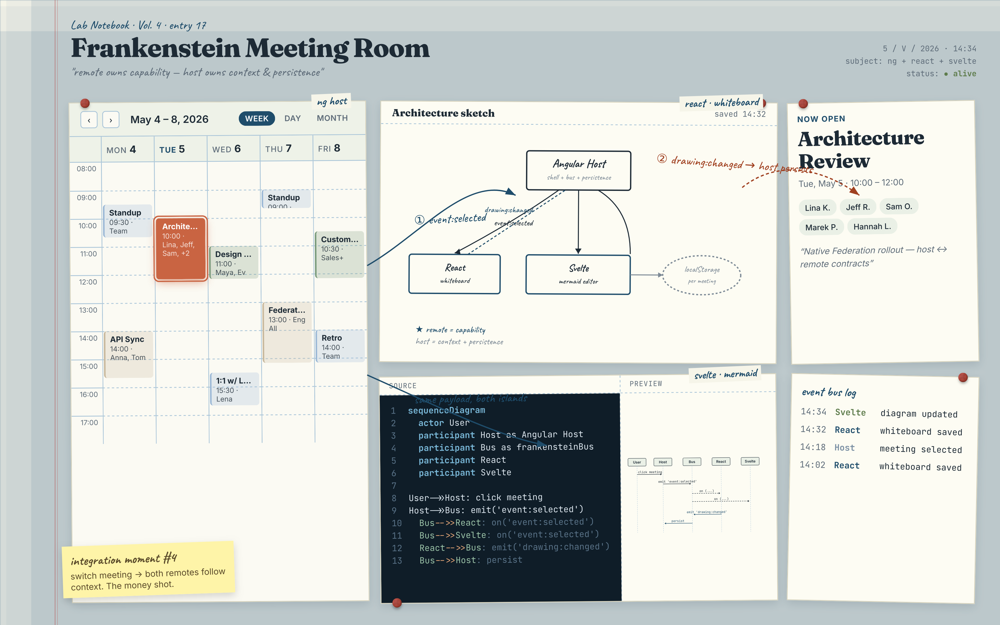
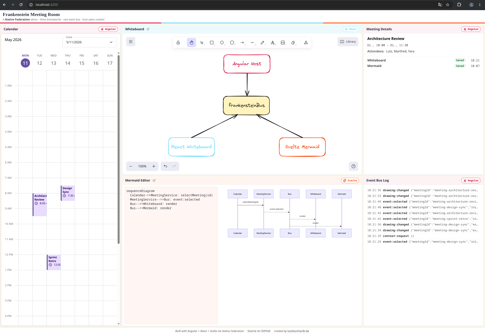

# Frankenstein Meeting Room

> Three frameworks, one workspace. Angular orchestrates. React draws. Svelte diagrams. Native Federation makes it work — without rewriting any of them.

**Live demo →** <https://lutzleonhardt.de/frankenstein-meeting-room/>

A deliberately small demo of a real enterprise frontend integration pattern: one host application, multiple inherited capabilities from foreign frameworks, one shared business context.

Call it **Frankenstein-Driven Architecture**.



> **Remote owns capability. Host owns business context and persistence.**

This is **not a meeting app.** It is not production software. It demonstrates an integration architecture for heterogeneous frontend stacks — the kind of stack you find inside any enterprise after two acquisitions and a framework war.

## TL;DR — Run it

```bash
pnpm install
pnpm -F whiteboard dev   # http://localhost:3000 — React remote
pnpm -F mermaid    dev   # http://localhost:4000 — Svelte remote
pnpm -F shell      start # http://localhost:4200 — Angular host
```

Open `http://localhost:4200`, click **Architecture Review** in the calendar — the [demo flow](#demo-flow) starts there.

Each remote also runs solo on its own port — open `:3000` or `:4000` directly to see the remote without the shell.

## Architecture in One Sketch

```
Angular Host (Frankenstein Meeting Room)
├── Calendar (Schedule-X, native, NOT federated)
├── Event Detail View
│   ├── Whiteboard Slot      ← React Remote  (Excalidraw, Native Federation)
│   └── Mermaid Editor Slot  ← Svelte Remote (Mermaid, Native Federation)
├── Event Bus (host ↔ remotes, framework-agnostic EventTarget)
└── LocalStorage (per meeting)
```

Each remote is a complete app in its own framework, exposed as a Custom Element. Host and remotes communicate exclusively through a typed event bus — no shared component model, no shared reactivity, no leaky framework abstractions. The host is the single broadcast point for business context.

## Tech Stack

| Layer | Choice |
|---|---|
| Host framework | Angular 20+ |
| Calendar | Schedule-X (`@schedule-x/angular`) |
| Whiteboard | Excalidraw (React 18+) |
| Diagram editor | Mermaid + Svelte 5 wrapper |
| Federation runtime | Native Federation v4 + Orchestrator |
| Host build | `@angular-architects/native-federation-v4` |
| Remote build | `@softarc/native-federation-esbuild` |
| Persistence | LocalStorage |
| Workspace | pnpm |

## Repository Layout

```
frankenstein-meeting-room/
├── pnpm-workspace.yaml
├── docs/
│   ├── specs/SPEC.md          ← full architectural spec
│   ├── build-modes.md         ← build scripts, dev/prod, clean
│   ├── plans/                 ← per-milestone task plans
│   └── task-log/              ← per-task implementation logs
└── packages/
    ├── shared/                ← bus.ts, types.ts, seed.ts
    ├── shell/                 ← Angular host
    ├── whiteboard/            ← React remote (Excalidraw)
    └── mermaid/               ← Svelte remote (Mermaid)
```

## Quick Start

```bash
pnpm install
```

Run the host and both remotes in three separate terminals:

```bash
# terminal 1 — React whiteboard remote (federate build + standalone watch)
pnpm -F whiteboard dev          # http://localhost:3000

# terminal 2 — Svelte mermaid remote (federate build + standalone watch)
pnpm -F mermaid dev             # http://localhost:4000

# terminal 3 — Angular host
pnpm -F shell start             # http://localhost:4200
```

Start the remotes before the shell — the shell loads their `remoteEntry.json` at boot.

Sample meetings are placed Mon/Tue/Wed of the current week by `seed.ts`, so a fresh clone always shows a populated calendar.

## Build Modes

The two remotes build along two orthogonal axes — standalone vs. federate, dev vs. prod:

| Script (per remote) | What it produces |
|---|---|
| `dev` | Federate (dev) + standalone dev server. Default for host-integration work. |
| `start:standalone:dev` | Standalone dev server only (no federate output). |
| `build:standalone` | Production standalone bundle in `dist/`. |
| `build:federate` | Production `remoteEntry.json` + chunks in `dist/`. |
| `build:federate:dev` | Same as above, with sourcemaps and `NODE_ENV=development`. |
| `clean` | Wipes `dist/` + cached federation metadata. Run before switching modes. |

The host uses the stock Angular CLI (`start` / `build`) plus its own `clean` that also clears `.angular/cache` and the Native Federation cache. `build` and `build:deploy` go through a small Node wrapper (`packages/shell/scripts/ng-build.mjs`) that exits as soon as the artifacts land, because the `@angular-architects/native-federation-v4` post-step hangs after a successful build — see [`docs/build-modes.md`](docs/build-modes.md#why-build--builddeploy-go-through-a-node-wrapper).

The `clean` scripts exist because Native Federation's caches and `dist/` can carry stale state across `ng build` ↔ `ng serve` transitions and across standalone-vs-federate builds. See [`docs/build-modes.md`](docs/build-modes.md) for the full story (including why `Schedule-X` lives in `devDependencies`).

## Subresource Integrity

Federation is a dynamic-loading architecture: the shell at runtime fetches a manifest, then each remote's `remoteEntry.json`, then each remote's chunks. Every one of those network calls is a potential tampering surface — flip a byte in any of them and you flip what executes in the user's browser. The production build closes this surface with [Subresource Integrity](https://developer.mozilla.org/en-US/docs/Web/Security/Subresource_Integrity): every dynamically-loaded file is hashed at build time, the hash travels with the reference, and the runtime refuses to execute a file whose bytes don't match.

Four entry points need to be locked down — three `remoteEntry.json` files (shell, whiteboard, mermaid) and the federation manifest itself. They're chained, not flat: each link certifies the next, and the chain's anchor is the shell bundle itself.

```
main.js  (Trust Root — built into the shell bundle)
  ├── manifestIntegrity              ← hash of federation.manifest.json
  └── hostRemoteEntry.integrity      ← hash of the shell's remoteEntry.json

federation.manifest.json
  ├── whiteboard: { url, integrity } ← hash of whiteboard/remoteEntry.json
  └── mermaid:    { url, integrity } ← hash of mermaid/remoteEntry.json

<remote>/remoteEntry.json
  └── integrity: { "<chunk>.js": "sha384-…" }   ← per-chunk hashes
```

The shell's `main.js` carries two hard-coded hashes — the manifest's hash and its own `remoteEntry.json`'s hash. Whoever can rewrite `main.js` can break the chain, but at that point they own the shell and the discussion is over. Everything below `main.js` is covered transitively: the manifest hash gates the manifest, which gates each remote, which gates that remote's chunks.

### What Native Federation gives you, and what you have to build yourself

Native Federation ships the *primitives* — per-chunk hashing inside each `remoteEntry.json`, runtime verification of fetched bytes, and runtime support for the `{ url, integrity }` option shapes. It does **not** ship the build-time choreography that turns those primitives into an end-to-end chain. That part is application-specific (which manifest, which host builder, two-pass vs. `define` vs. codegen) and lives in your own deploy script. If you're adapting this pattern to a different repo, the split looks like this:

| Step | Who? |
|---|---|
| Per-chunk hashes inside each `remoteEntry.json` (`integrity: { "<chunk>.js": "sha384-…" }`) | **Native Federation** (once `features.integrityHashes: true` is set in `federation.config.*`) |
| Runtime verification of fetched `federation.manifest.json` and `remoteEntry.json` bytes | **NF Orchestrator** in JS, via `crypto.subtle.digest()`. JSON isn't a `<script>`, so browser-native SRI doesn't apply. |
| Runtime verification of each chunk against the importmap `integrity` entries | **`es-module-shims`** in JS. Browser-native importmap-integrity is specced but not universally enforced; the shim closes the gap. `useShimImportMap({ shimMode: true })` is load-bearing — without it, chunk-level SRI silently degrades. |
| Runtime support for `manifestIntegrity` / `hostRemoteEntry: { url, integrity }` options on `initFederation` | **NF Orchestrator** |
| Hashing each `remoteEntry.json` file *as a whole* (the wrapper, not its inner chunks) | **You** (build script) |
| Composing the prod manifest with object-shape entries and the `./`-prefix | **You** (build script) |
| Hashing the prod manifest | **You** (build script) |
| Hashing the host's own `remoteEntry.json` | **You** (build script) — needs a two-pass host build to break the chicken-and-egg |
| Injecting those three hashes into the host bundle as compile-time constants | **You** (codegen or `define` — your host builder's choice) |
| Dev/prod toggle so `ng serve` and watch rebuilds stay SRI-free | **You** |

In this repo, "you" is [`scripts/build-deploy.mjs`](scripts/build-deploy.mjs) plus the generated [`packages/shell/src/generated/sri-constants.ts`](packages/shell/src/generated/sri-constants.ts). If you're porting the pattern, that's the file pair to clone.

> **Why `es-module-shims` is mandatory.** Importmap entries can carry an `integrity` block that tells the browser to verify each dynamically-imported module against a hash. The spec exists, but native browser enforcement is still rolling out and **not universally implemented** as of writing. A browser without enforcement will simply ignore the `integrity` block — chunk-level SRI degrades silently, with no error, no console warning, no broken page. That's the worst possible failure mode for a security feature: it looks like it works. [`es-module-shims`](https://github.com/guybedford/es-module-shims), running in `shimMode: true`, takes over module loading in JS and enforces the integrity check itself. As long as it's loaded as a polyfill and the orchestrator is configured with `useShimImportMap({ shimMode: true })`, chunk-level SRI is verified consistently across all evergreen browsers — independent of how far each one's native implementation has progressed. Drop the shim and module-level SRI becomes "best effort"; keep it and the chain is closed end-to-end.

SRI is **production-only**. Dev mode (`pnpm run dev`, `ng serve`) is SRI-free so that watch-driven rebuilds of one remote don't force a shell rebuild. The full build-pipeline mechanics — two-pass shell build, secure-context requirement, recovery hints — live in [`docs/deployment.md`](docs/deployment.md#subresource-integrity). The Native Federation orchestrator's canonical SRI documentation: [`native-federation.com/docs/orchestrator/security.html#subresource-integrity`](https://native-federation.com/docs/orchestrator/security.html#subresource-integrity).

## Demo Flow



A 30-second click-through that exercises every integration moment. With all three dev servers running and a cleared LocalStorage:

1. Open `http://localhost:4200`. The calendar shows three meetings this week.
2. Click **Architecture Review**. Excalidraw renders a populated sketch (React remote), Mermaid renders the seeded sequence diagram (Svelte remote). The right column fills in with title, time, attendees, and the **Whiteboard / Mermaid last-changed timestamps**. The Bus Log shows one `event:selected` plus two `context:request` rebroadcasts.
3. Edit the Mermaid source. The Bus Log shows `diagram:changed` rows at ~500 ms cadence; the **Mermaid** row in Meeting Details ticks forward.
4. Draw on the Excalidraw canvas. The Bus Log shows `drawing:changed` rows; the **Whiteboard** row ticks. Resize / scroll / select fire *nothing* — the producer dedups by element version.
5. Open DevTools → Network, reload, filter by `*.js`. Three distinct origins serve their respective bundles: `:4200` (Angular shell), `:3000` (React whiteboard), `:4000` (Svelte mermaid). *Three frameworks, one workspace.*

## Why This Pattern

Heterogeneity in enterprise frontends is permanent. Acquisitions bring new stacks, teams pick what they know, framework tides shift. The rewrite-first approach treats this as a problem to be eliminated; this repo treats it as a constraint to design with.

This pattern is for:

- **Acquired frontend stacks** that must coexist with the parent's stack
- **Long-lived Angular (or React, or Vue) shells** that need to keep shipping
- **Teams that cannot rewrite everything** — and shouldn't have to
- **Capabilities easier to build in another ecosystem** (Excalidraw is React; you don't port it)
- **Migration paths** where old and new must coexist for years, not weeks

Old code keeps shipping. New capabilities arrive as islands. No all-or-nothing rewrite gate.

## Out of Scope (Production Concerns)

This is a demo of an integration architecture, not a production application. Deliberately out of scope:

- Authentication and authorization
- Cross-origin deployment, CSP hardening (SRI *is* in scope — see [Subresource Integrity](#subresource-integrity))
- Backend persistence, server-side rendering
- Multi-user collaboration, optimistic locking, CRDTs
- Contract versioning between host and remotes
- Observability, error boundaries, remote-availability fallback
- Mobile responsive layouts (desktop-only by design)
- Tests

If your reaction is *"but a real production system would need X"*: yes, exactly. The architecture is what's being demonstrated, not a production-ready meeting app.

## Reading Order

1. The Dev.to series for the narrative and the *why*:
   - [The Frankenstein Meeting Room: How to stitch Angular, React, and Svelte into one app](https://dev.to/lutz_leonhardt/-the-frankenstein-meeting-room-how-to-stitch-angular-react-and-svelte-into-one-app-351g) — the architectural argument.
   - [Frankenstein Meeting Room — three apps in one browser tab](https://dev.to/lutz_leonhardt/frankenstein-meeting-room-three-apps-in-one-browser-tab-igi) — the build-it walkthrough.
   - [Frankenstein Meeting Room — drei Apps in einem Browser-Tab](https://dev.to/lutz_leonhardt/frankenstein-meeting-room-drei-apps-in-einem-browser-tab-24p7) — deutsche Fassung.
2. [`docs/specs/SPEC.md`](docs/specs/SPEC.md) for the technical depth.
3. [`docs/build-modes.md`](docs/build-modes.md) for the build / dev-loop details.
4. [`docs/deployment.md`](docs/deployment.md) for the build-and-deploy workflow that produces the live demo.
5. The code, package by package.

## License

MIT.
